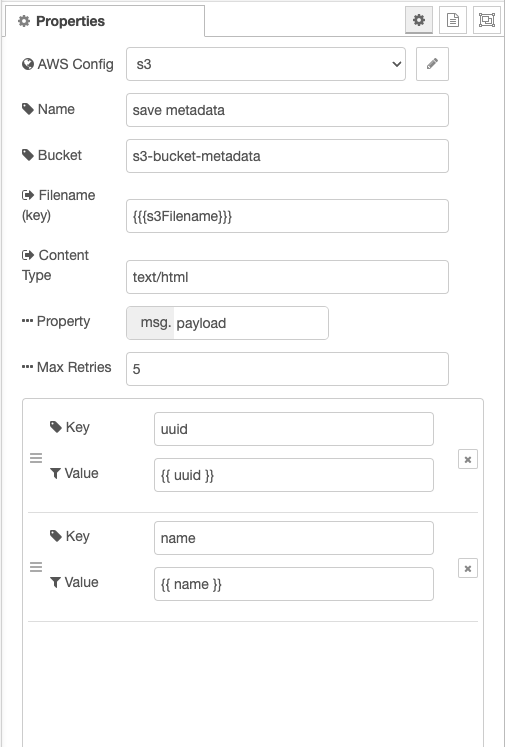
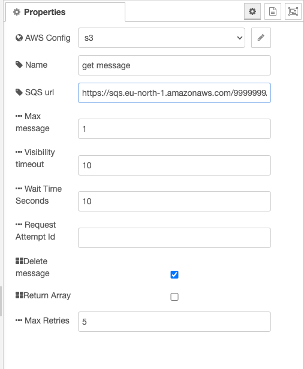

# Node RED AWS cloud nodes

### Installation

```sh
npm i @nickcuper/node-red-contrib-aws-cloud
```

```sh
yarn add @nickcuper/node-red-contrib-aws-cloud
```

### Nodes
- config node
- s3-write
- sqs-read

### S3 Node



### SQS Node

